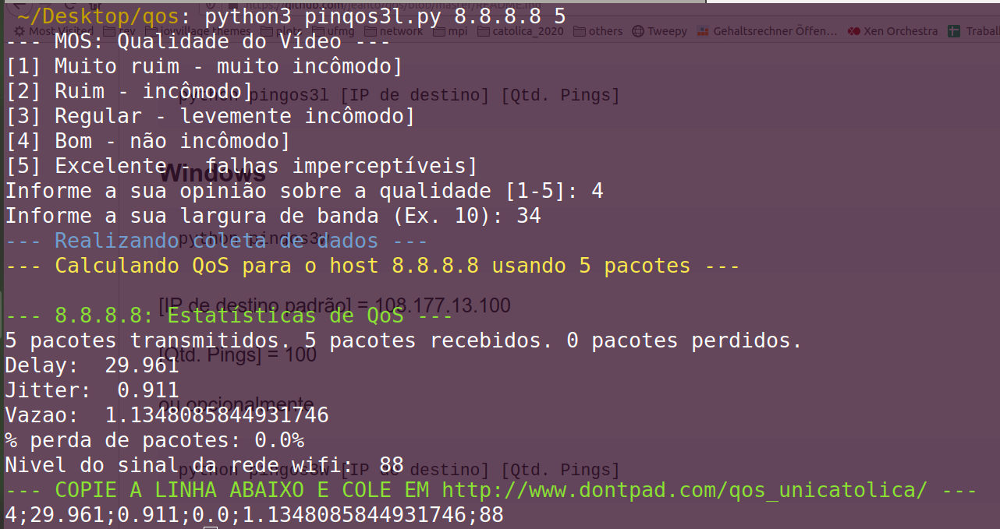

# PinQoS: Calculadora de Qualidade de Serviço Simples usando ICMP

Calculadora de QoS que usa o protocolo ICMP em python.

### Pré-requisitos

O que você precisa instalar

```
python3
```

### Sistemas operacionais compatíveis

Windows 10 e Linux Ubuntu ou baseado em Debian

## Executando

Como rodar a calculadora! 

### Linux ubuntu

```
python pingos3l [IP de destino] [Qtd. Pings]
```
ou

```
python pinqos3l
```
Para este último caso:

[IP de destino padrão] = 108.177.13.100 (google meet)

[Qtd. Pings] = 100


### Windows

```
python pingos3w [IP de destino] [Qtd. Pings]
```
ou

```
python pinqos3w
```

Para este último caso:

[IP de destino padrão] = 108.177.13.100 (google meet)

[Qtd. Pings] = 100


## Resultado


